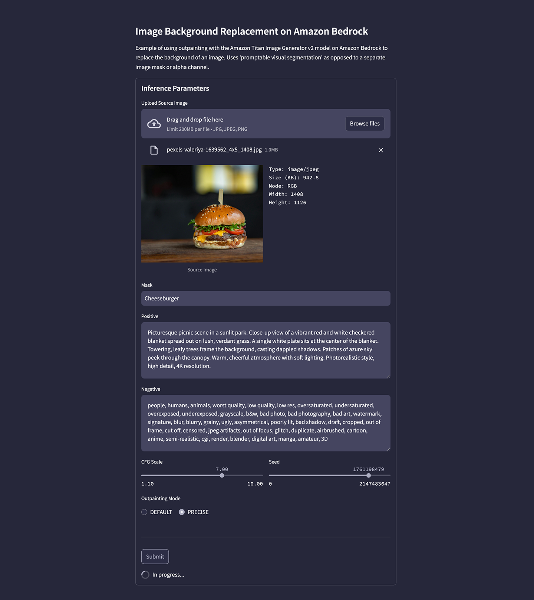
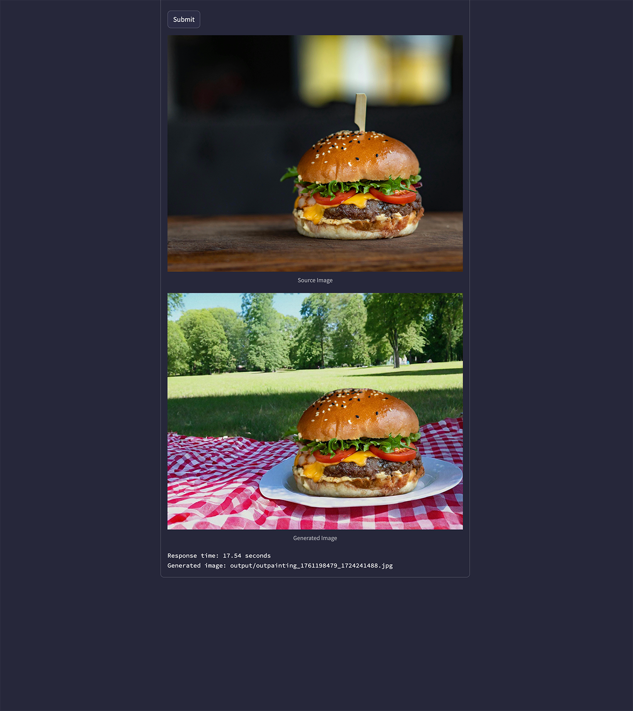

# Titan Image Generator v2 Outpainting Example

Simple [Streamlit](https://streamlit.io/) application that uses the Amazon Bedrock API to call the Amazon Titan Image Generator v2 model and replaces an image's background using outpainting.

## Foundation Model Access

Ensure you have access to the Amazon Titan Image Generator G1 v2 model in the "Model access" tab of the [Amazon Bedrock](https://us-east-1.console.aws.amazon.com/bedrock/home) Web Console.

## Prepare Local Environment

Create Python virtual environment locally and install required packages (1x only). Script assumes you already have a recent version of [Python 3](https://www.python.org/downloads/) installed and use a `python3` alias.

### Mac

```sh
# I am running Python 3.12 or later
python3 --version

python3 -m venv .venv
source .venv/bin/activate

pip install pip --upgrade
pip install -r requirements.txt --upgrade
```

### Windows

```bat
REM I am running Python 3.12 or later
python --version 

python -m venv .venv
.venv\Scripts\activate

python -m pip install pip --upgrade
python -m pip install -r requirements.txt --upgrade
```

## Authenticate to AWS

Provide your AWS credential on the commandline or authenticate in your normal way before starting the application.

### Mac

```sh
export AWS_ACCESS_KEY_ID="<YOUR_AWS_ACCESS_KEY_ID>"
export AWS_SECRET_ACCESS_KEY="<YOUR_AWS_SECRET_ACCESS_KEY>"
export AWS_SESSION_TOKEN="<YOUR_AWS_SESSION_TOKEN>"
```

### Windows

```bat
SET AWS_ACCESS_KEY_ID=YOUR_AWS_ACCESS_KEY_ID
SET AWS_SECRET_ACCESS_KEY=YOUR_AWS_SECRET_ACCESS_KEY
SET AWS_SESSION_TOKEN=YOUR_AWS_SESSION_TOKEN
```

## Run Streamlit Application

Start the Streamlit application. The application should start locally on `http://localhost:8501` and open in your web browser automatically. View the terminal output for more logging information.

```sh
streamlit run app.py --server.runOnSave true
```

You can [pass custom arguments](https://docs.streamlit.io/develop/api-reference/cli/run) to Streamlit when starting the application. For example:

### Mac

```sh
streamlit run app.py \
    --server.runOnSave true \
    --theme.base "dark" \
    --theme.backgroundColor "#26273B" \
    --theme.primaryColor "#ACADC1" \
    --theme.secondaryBackgroundColor "#454560" \
    --theme.font "sans serif"\
    --ui.hideTopBar "true" \
    --client.toolbarMode "minimal"
```

### Windows

```bat
streamlit run app.py ^
    --server.runOnSave true ^
    --theme.base "dark" ^
    --theme.backgroundColor "#26273B" ^
    --theme.primaryColor "#ACADC1" ^
    --theme.secondaryBackgroundColor "#454560" ^
    --theme.font "sans serif"^
    --ui.hideTopBar "true" ^
    --client.toolbarMode "minimal"
```

## Sample Image

The [burger image](pexels-valeriya-1639562_4x5_1408.jpg) used in the demonstration is from [Pexels.com](https://www.pexels.com/photo/close-up-photo-of-burger-1639562). Photo by Valeria Boltneva.

## Application Preview

Video preview of application on [YouTube](https://youtu.be/dR1VVFKOF_g?si=qVyFX7lD4q3hxXlA).

Screengrabs of the application.





---

_The contents of this repository represent my viewpoints and not of my past or current employers, including Amazon Web Services (AWS). All third-party libraries, modules, plugins, and SDKs are the property of their respective owners._
