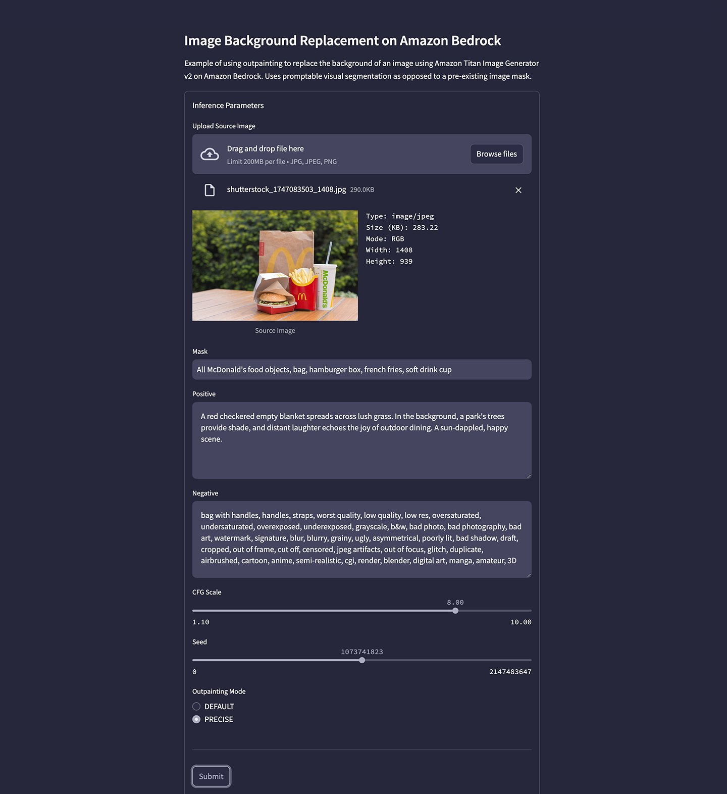
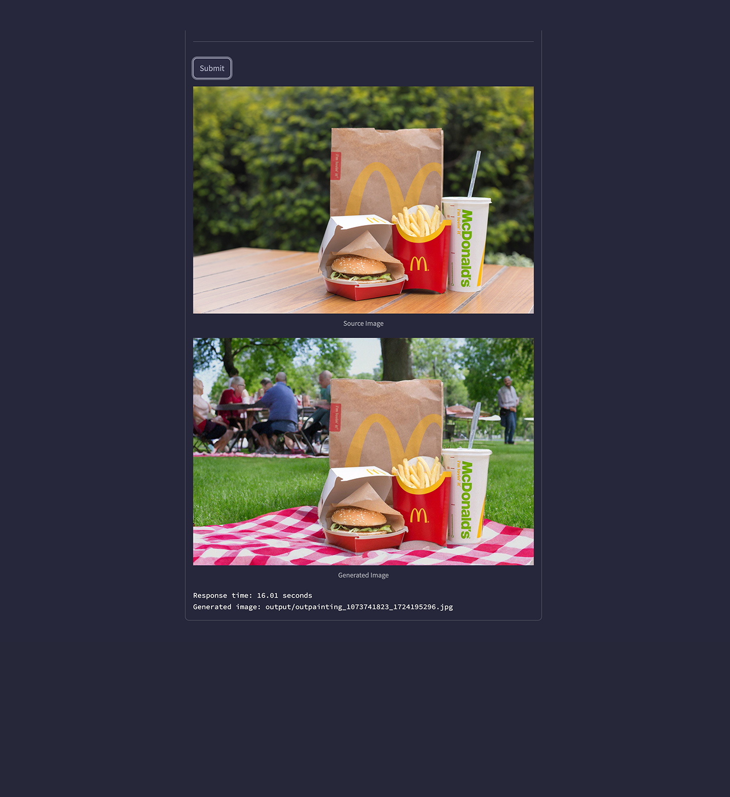

# Streamlit, Amazon Bedrock, TIG v2 Example Application

Simple [Streamlit](https://streamlit.io/) application that uses the Amazon Bedrock API to call the Amazon Titan Image Generator v2 model and replace an image's background using outpainting.

## Foundation Model Access

Ensure you have access to the Amazon Titan Image Generator v2 model in the Model access tab of the [Amazon Bedrock](https://us-east-1.console.aws.amazon.com/bedrock/home) Web Console.

## Prepare Local Environment

Create Python virtual environment locally and install required packages (1x only). Script assume you already have a recent version of [Python 3](https://www.python.org/downloads/) installed and use a `python3` alias.

```sh
sh ./env_setup.sh
```

## Authenticate to AWS

Provided your AWS credential on the commandline or authenticate in your normal way before starting the application.

```sh
export AWS_ACCESS_KEY_ID="<YOUR_AWS_ACCESS_KEY_ID>"
export AWS_SECRET_ACCESS_KEY="<YOUR_AWS_SECRET_ACCESS_KEY>"
export AWS_SESSION_TOKEN="<YOUR_AWS_SESSION_TOKEN>"
```

## Run Streamlit Application

Start the Streamlit application. The application should start locally on `http://localhost:8501` and open in your browser automatically. View the terminal output for more information.

```sh
streamlit run app.py --server.runOnSave true
```

You can [pass custom arguments](https://docs.streamlit.io/develop/api-reference/cli/run) to Streamlit when starting the application. For example:

```sh
streamlit run app.py \
    --server.runOnSave true \
    --theme.base "dark" \
    --theme.backgroundColor "#26273B" \
    --theme.primaryColor "#ACADC1" \
    --theme.secondaryBackgroundColor "#454560" \
    --theme.font "sans serif"\
    --ui.hideTopBar "true" \
    --client.toolbarMode "minimal"
```

## Application Preview

Preview of the application.





